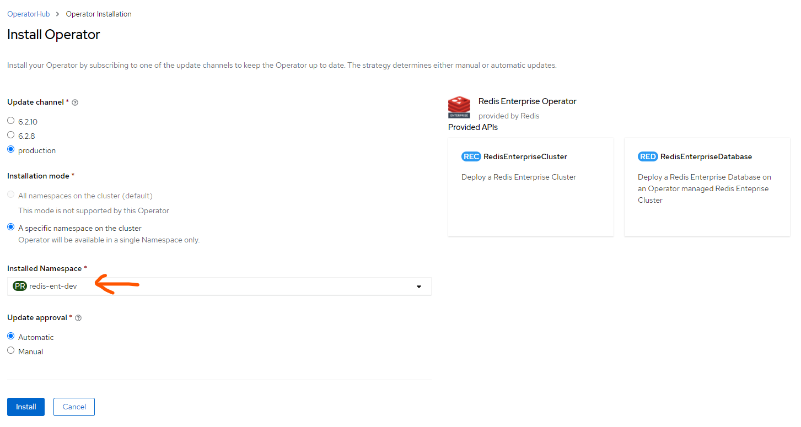

## Install and Configure Java

> Note: this is an optional step, you can use any Java version starting from 11 and above

Install Java 17 on your local machine:
```
❯ tar xvf OpenJDK17U-jdk_x64_linux_hotspot_17.0.2_8.tar.gz

❯ sudo mv jdk-17.0.2+8 /opt/java/
```

Add Java to the profile:
```
❯ nano .profile
```

Modify the file:
```
# adding java to the path
PATH=$PATH:/opt/java/jdk-17.0.2+8/bin:/opt/java/jdk-17.0.2+8/lib
JAVA_HOME=/opt/java/jdk-17.0.2+8
```

Reload the profile and check java version
```
❯ source .profile
❯ java -version
```

Configure the VSCode (add to your settings.json):

```
    "java.configuration.runtimes": [
        {
          "name": "JavaSE-17",
          "path": "/opt/java/jdk-17.0.2+8",
          "default": true
        },
      ]
```

## Install Redis Operator and Create Redis Cluster

> Note: you should already have your OpenShift cluster installed and configured at this point. Check [RedHat documentation](https://docs.openshift.com/container-platform/4.9/installing/index.html) for details.

> Note: you also need to have OpenShift CLI installed on your local machine. Check [RedHat documentation](https://docs.openshift.com/container-platform/4.9/cli_reference/openshift_cli/getting-started-cli.html) on how to get it installed.

Export KUBECONFIG to point to your OpenShift cluster config:
```
export KUBECONFIG=/<your-cluster-configuration-dir>/auth/kubeconfig
```

Create the new project (namespace) for Redis cluster:
```
oc new-project redis-ent-dev
```
Follow [this documentation](https://github.com/RedisLabs/redis-enterprise-k8s-docs/tree/master/openshift/OLM) to find and install _Redis Enterprise Operator_ in the OperatorHub - make sure to install it to the project you created in the prior step:


> Note: this guide was created to simplify the deployment of RedisBank application in OpenShift environment. For production workloads you almost always want to deploy your workloads separately (to a different namespace) from Redis Enterprise namespace. 

## Create Redis Database

First, create a secret for a default user in your database:

```
oc apply -f bankdb-pwd.yaml
```

> Note: if you want to modify the password, make sure you also change it in the `openshift` configuration for the application (application-openshift.properties).

To create a new database you can use the [provided resource file](bankdb.yaml):

> Note: modify the name and namespace for your database accordingly

> Note: the list of modules that the cluster supports can be found at the very bottom of your REC cluster YAML file:


```
oc apply -f bankdb.yaml
```

## Build and Deploy the Application

We are going to use [Eclipse JKube Maven Plugin](https://www.eclipse.org/jkube/docs/openshift-maven-plugin#_configuration) for Kubernetes and OpenShift to automate the resources creation and also implement S2I (source to image) build process that is often used in OpenShift environment.

### Configure

In `pom.xml` add [jkube](https://github.com/eclipse/jkube/tree/master/openshift-maven-plugin) maven plugin - it will help to generate the required resources and deploy the application to OpenShift:

```
<plugin>
	<groupId>org.eclipse.jkube</groupId>
	<artifactId>openshift-maven-plugin</artifactId>
	<version>1.8.0</version>
</plugin>
```

In `src/main/resources/application-openshift.properties` change the following settings:

```
# stomp.host=<app-name-namespace>.apps.<cluster-name>.<dns-zone>
# for example:
stomp.host=redisbank-redis-ent-dev.apps.c1.openshift.demo.redislabs.com
stomp.protocol=ws
stomp.port=80
spring.redis.host=bankdb
spring.redis.port=12869
spring.redis.password=redisbank
```

> Note: make sure your application is using the `openshift` profile. One way to set this in a Spring application is to modify the `application.properties` file:

```
spring.profiles.active=openshift
```

### Build Locally

This will create and repackage the jar file with all the required resources:

```
./mvnw clean package -Dmaven.test.skip=true
```

### Build Remotely

This command will trigger the remote S2I build process. It will also create the _ImageSet_ and the _BuildConfig_ in your OpenShift cluster if not created yet:

```
./mvnw oc:build -Dmaven.test.skip=true 
```

### Deploy

Generate the _DeploymentConfig_ resources for your application:
```
./mvnw oc:resource
```

Apply the resources to create the _DeploymentConfig_, _Service_ and _Route_ generated in a previous step:

```
./mvnw oc:apply
```

> Note: you can use the undeploy command: `./mvnw oc:undeploy` if you need to undepoy the application completely

At this point of time your application is already deployed and supposed to be up and running. Go check the your Openshift web console on the status and pull the route url to access the app from your browser. This will typically look like this:

`http://redisbank-<namespace>.<cluster-name>.<dns-zone>`